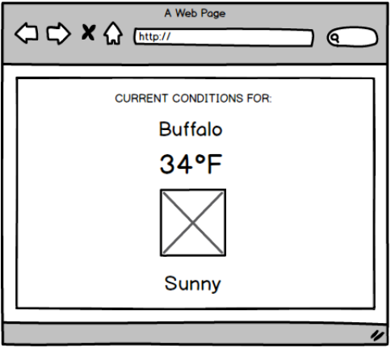

# Synacor Senior Developer Code Challenge

At Synacor, we often write microservices as facades for one or more third-party services. These microservices fulfill two purposes:

* They enable us to make the calls that make sense for our uses, not the calls that the third-party provider designed in (AKA massaging data to better fit our needs)
* Caching, of course

We then hook these microservices up to a front-end that displays the result of the work.

We’d like to see how you can handle working with this kind of a product.

- [The back end challenge](#the-back-end-challenge)
	- [Request and response formats](#request-and-response-formats)
	- [Third-party APIs](#third-party-apis)
		- [Location](#location)
		- [Weather](#weather)
	- [Service acceptance criteria](#service-acceptance-criteria)
- [The front end challenge](#the-front-end-challenge)
	- [APIs](#apis)
		- [Geolocation](#geolocation)
		- [Weather](#weather)
	- [The page](#the-page)
	- [Front end acceptance criteria](front-end-acceptance-criteria)

## The Back End Challenge

We have a third-party provider who gives us weather for given locations. Their API response includes all of their weather data for a single location. Our front-end displays a _limited subset_ of that weather data for _multiple_ user-favorited locations. (The front-end handles management of user favorites through a separate service; in this case, just go ahead and choose 5 locations).

There is a second API which we use to translate user-favorited locations -- e.g. “Baltimore, MD” -- to the latitude/longitude dyad required by our weather partner, e.g. “39.29, -76.61”. This API provider is pretty flaky, so handling their slowness and errors is a significant issue for us.

We need an internal API that serves as a facade for these two services, allowing our front end developers to make a single API request to power the UI of the entire widget. Your service will field these requests which contain multiple location values (e.g., ["Baltimore, MD", "Reston, VA", "Playa Vista, CA"]), and return just the information needed by the UI. The UI is expecting the following data points, for each location, to create an entry: Location, Temperature, Icon URL.

### Request and response formats

Please feel free to design this API as you see best. However, it should:

* Take multiple locations, each in a “City, St.” format
* For each location, return the location, temperature, and a URL pointing to an icon for the weather type
* Fail gracefully, or otherwise handle well, an error from either API

### Third-Party APIs

We have two CORS-enabled API endpoints:

#### Location
https://us-central1-location-service-6a71d.cloudfunctions.net/getLatLong?city={city}&state={st}

Get the geocoded information for the city and state. For example:

```
GET  https://us-central1-location-service-6a71d.cloudfunctions.net/getLatLong?city=baltimore&state=md
```
Will return:
```json
[{
	"address_components": [{
			"long_name": "Baltimore",
			"short_name": "Baltimore",
			"types": [
				"locality",
				"political"
			]
		},
		{
			"long_name": "Maryland",
			"short_name": "MD",
			"types": [
				"administrative_area_level_1",
				"political"
			]
		},
		{
			"long_name": "United States",
			"short_name": "US",
			"types": [
				"country",
				"political"
			]
		}
	],
	"formatted_address": "Baltimore, MD, USA",
	"geometry": {
		"bounds": {
			"northeast": {
				"lat": 39.3722059,
				"lng": -76.5294528
			},
			"southwest": {
				"lat": 39.1972069,
				"lng": -76.71151909999999
			}
		},
		"location": {
			"lat": 39.2903848,
			"lng": -76.6121893
		},
		"location_type": "APPROXIMATE",
		"viewport": {
			"northeast": {
				"lat": 39.3722059,
				"lng": -76.5294528
			},
			"southwest": {
				"lat": 39.1972069,
				"lng": -76.71151909999999
			}
		}
	},
	"place_id": "ChIJt4P01q4DyIkRWOcjQqiWSAQ",
	"types": [
		"locality",
		"political"
	]
}]
```

> _Note:_ The value you need there is in `geometry.location`.

### Weather
https://weathersync.herokuapp.com/forecast/$lat,$lng

Get weather for a given latitude and longitude. For example:

```
GET https://weathersync.herokuapp.com/forecast/39.2903848,-76.6121893
```

Will return

```json
{
	"coord": {
		"lon": -76.61,
		"lat": 39.29
	},
	"weather": [{
		"id": 804,
		"main": "Clouds",
		"description": "overcast clouds",
		"icon": "04n"
	}],
	"base": "stations",
	"main": {
		"temp": 282.48,
		"pressure": 1019,
		"humidity": 87,
		"temp_min": 281.15,
		"temp_max": 284.15
	},
	"visibility": 16093,
	"wind": {
		"speed": 1.69,
		"deg": 237.501
	},
	"clouds": {
		"all": 90
	},
	"dt": 1510797120,
	"sys": {
		"type": 1,
		"id": 1315,
		"message": 0.17,
		"country": "US",
		"sunrise": 1510833088,
		"sunset": 1510869042
	},
	"id": 4347778,
	"name": "Baltimore",
	"cod": 200
}
```

>_Note:_ This API call will return an {icon} property. Your API should return an _absolute_ URL for the icon, formed as http://openweathermap.org/img/w/${icon}.png

### Service Acceptance Criteria

You may use PHP, Go, or Node.js to complete this task.

* Code must be written by you, with minimal libraries or dependencies.

	* If you use Go, please try to use only the stdlib.
	* For PHP, please use version 7. If you choose to use a framework, you may use Lumen.
	* If you use Node, you may use any LTS version you prefer, and also use Express, Koa, or Hapi, and a test framework of your choice.

* Assume your service is behind a reverse proxy, and attempt to return sensible cache headers.
* **Handle provider errors reasonably.**
* Our providers update their current temperature readings every 10 minutes.
* **Provide unit tests (really, we test everything at Synacor).**
* Document your API in a README.md (or another format if you have a tool that you prefer, and which distributes documentation that we can read in a text editor or Web browser).

## The Front End Challenge

Now that you've written an API, use it! Your challenge is to build a small page that shows the weather at 4 favorited locations and the user's current location.

### APIs

#### Geolocation

To get the city and state for the current user, we provide a CORS-enabled endpoint at https://weathersync.herokuapp.com/location/. This will return the current user's city/state, identified from their IP address (it's possible that the service will be unable to find a location. If nothing is returned, provide a default of Buffalo, NY).

```
GET https://weathersync.herokuapp.com/location
```
Will return:
```json
{
	"city": "El Segundo",
	"region_code": "CA"
}
```

#### Weather

Use your Weather API to send ```City, ST``` requests and get back the weather.

Provide 4 pre-set options and also add an option that is the city, state from their location

### The Page

Build a simple page that does the following:

1. Makes a GET request to the IP geolocation API, which returns a JSON response containing the city and state of the IP address for which the request originated;
2. Makes a subsequent request to your weather API with that information and four other cities of your choice
3. Renders a User Interface that displays the temperature, a text description of the current weather conditions, an icon representing those conditions, and the city, for each city you pass.

> Note: Icons
> The `icon` property returned from the weather endpoint can be used to request a
> PNG icon image using this URL:
> `http://openweathermap.org/img/w/${icon}.png`
> (example: http://openweathermap.org/img/w/03n.png)

### Front End Acceptance Criteria
- You may use any version of JavaScript/ECMAScript you like.
- Code must be written by you, with no libraries or dependencies.
- Must run in modern browsers (Chrome & Firefox are fine). Don’t worry about supporting old browsers.
- **Handle provider errors reasonably.**
- The User Interface should fill the browser window.
- **Provides unit tests (really, we test everything at Synacor).**
- The wireframe below describes what the layout should look like. Feel free to use whatever colors, fonts, and other design elements you like. Note: other than the requirements stated above, you won’t be judged on design.

